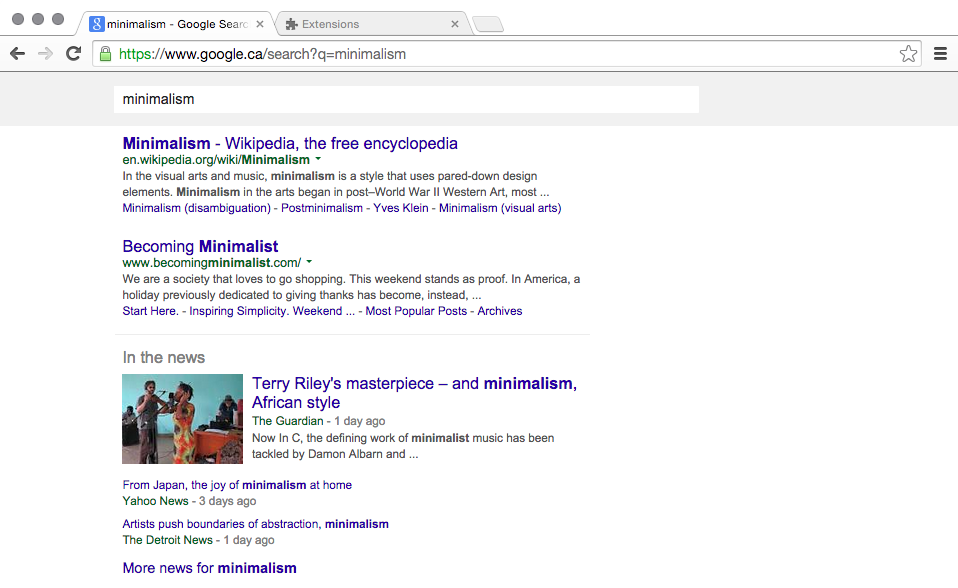

# Google Search for Power Users #

Strip away everything from Google Search except the search bar and results. Make the Tab key practical.

Use `Tab` to navigate links, and `/` to google.

## note ##

If you use [Personal Blocklist (by Google)](https://chrome.google.com/webstore/detail/nolijncfnkgaikbjbdaogikpmpbdcdef), and you want to block a domain, you will have to disable this extension in __Extensions --> Google Search Power User Edition --> Enabled__ (uncheck the box).

## todo ##

- Sometimes the footer will not be pushed all the way to the bottom when the window is maximized. To make debugging even funner, it gets pushed whenever I open the dev console.
- Will add options to not hide certain elements (blocklist buttons and G+ notifications)
- Might add ability to navigate with `hjkl` someday

## contributing ##

I probably missed a few links that should not be highlighted when you press Tab. Open an issue if you find something I missed, make sure to include the search query.
